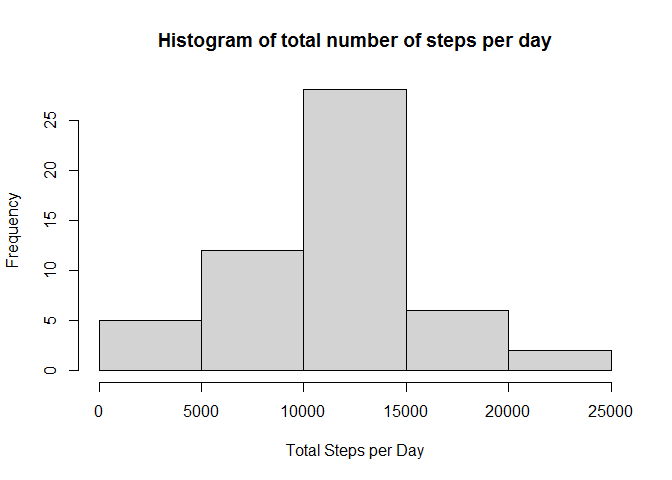
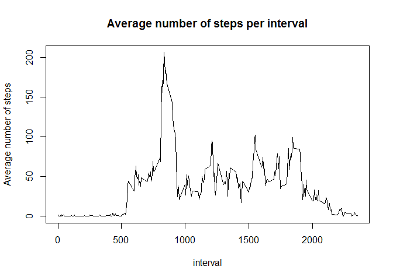
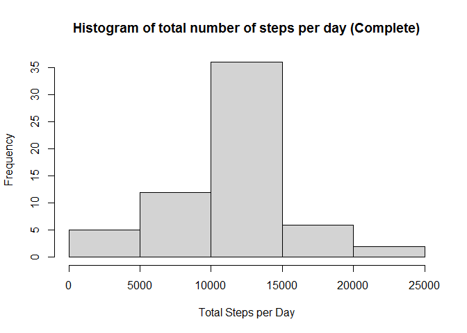
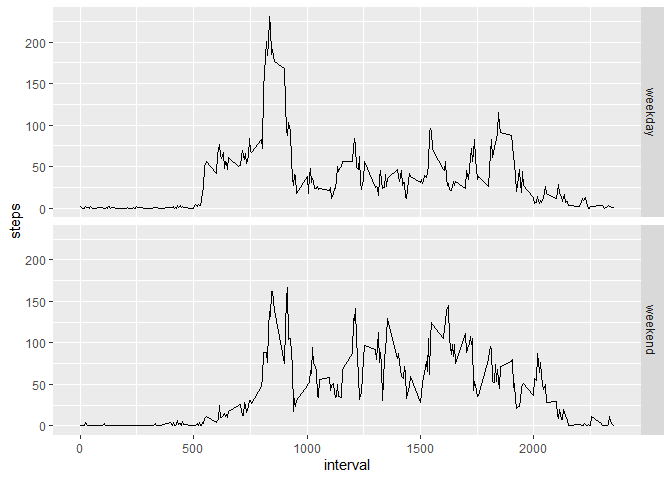

## Loading and preprocessing the data

```r
Sys.setlocale("LC_TIME", "C")
```

```
## [1] "C"
```

```r
library(lubridate)
```

```
## Warning: package 'lubridate' was built under R version 4.0.3
```

```
## 
## Attaching package: 'lubridate'
```

```
## The following objects are masked from 'package:base':
## 
##     date, intersect, setdiff, union
```

```r
Data <- read.csv("activity.csv")
Data$date <- ymd(Data$date)
Data$day <- weekdays(Data$date)
```
## What is mean total number of steps taken per day?


```r
TotalStepsperDay <- aggregate(steps ~ date, data = Data, function(x) sum(x, na.rm = TRUE))
hist(TotalStepsperDay$steps, xlab = "Total Steps per Day", main = "Histogram of total number of steps per day")
```

<!-- -->

```r
mean <- mean(TotalStepsperDay$steps)
mean
```

```
## [1] 10766.19
```

```r
median <- median(TotalStepsperDay$steps)
median
```

```
## [1] 10765
```


## What is the average daily activity pattern?


```r
AverageStepsperInterval <- aggregate(steps ~ interval, data = Data, function(x) mean(x, na.rm = TRUE))
plot(steps ~ interval, data = AverageStepsperInterval, type = "l", ylab = "Average number of steps", 
     main = "Average number of steps per interval")
```

<!-- -->

```r
AverageStepsperInterval[which.max(AverageStepsperInterval$steps),]  # This is the interval with on average maximum steps
```

```
##     interval    steps
## 104      835 206.1698
```

## Imputing missing values


```r
sum(is.na(Data$steps))    # Total Number of missing values in the dataset 
```

```
## [1] 2304
```

```r
# Replace missing values by the mean of that 5-minute interval
CompleteData <- Data
for(i in 1:(dim(CompleteData)[1])){
if(is.na(CompleteData$steps)[i]){
   CompleteData$steps[i] <- AverageStepsperInterval$steps[CompleteData$interval[i] == AverageStepsperInterval$interval]
}}

TotalStepsperDayComplete <- aggregate(steps ~ date, data = CompleteData, function(x) sum(x, na.rm = TRUE))
hist(TotalStepsperDayComplete$steps, xlab = "Total Steps per Day", main = "Histogram of total number of steps per day (Complete)")
```

<!-- -->

```r
mean <- mean(TotalStepsperDayComplete$steps)
mean
```

```
## [1] 10766.19
```

```r
median <- median(TotalStepsperDayComplete$steps)
median
```

```
## [1] 10766.19
```
The median differs slightly, but the mean is the same. 
The total daily number of steps increase. Before imputing missing data, for some days no total number of steps could be calculated. 

## Are there differences in activity patterns between weekdays and weekends?


```r
library(ggplot2)
```

```
## Warning: package 'ggplot2' was built under R version 4.0.3
```

```r
CompleteData$Weekday <- ifelse(CompleteData$day %in% c("Saturday" , "Sunday"), "weekend", "weekday")
AverageStepsperIntervalComplete <- aggregate(steps ~ interval + Weekday, data = CompleteData, function(x) mean(x, na.rm = TRUE))
qplot(interval,steps , data = AverageStepsperIntervalComplete, facets = Weekday~., geom = "line")
```

<!-- -->
